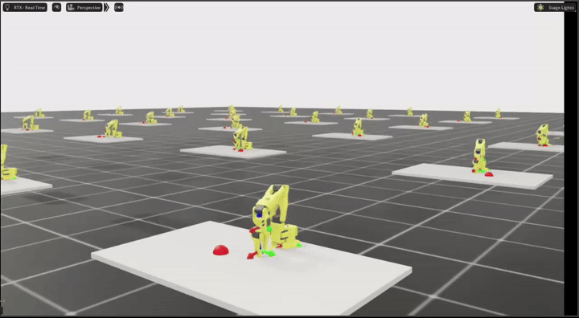

# SO-ARM101 Reinforcement Learning for Pick-and-Place

[](https://www.python.org/)
[](https://docs.isaacsim.omniverse.nvidia.com/)
[](https://isaac-sim.github.io/IsaacLab/)
[](https://github.com/astral-sh/uv)

This project trains and evaluates reinforcement-learning policies for SO-ARM101 manipulation in Isaac Lab, with a focus on bowl-based pick-and-place under randomized object colors and increasingly cluttered task structure.

The current policies cover state-based AprilTag-style deployment inputs, multi-object target selection, ordered sequential placement, a vision-based student policy, and a real-world transfer demo.

## Highlights

- Single-cube pick-and-place reaches **100% success** over 100 parallel evaluation episodes.
- Two-cube color-conditioned pick-and-place reaches **94% strict success**.
- Four-cube ordered sequential pick-and-place reaches **65% strict all-steps success**.
- Vision-based student policy runs the same single-cube bowl task directly from visual observations.
- Real-world execution is included as a short demonstration video.

## Evaluation Summary

All commands below are intended to be run from the [`isaac_so_arm101`](isaac_so_arm101) directory.

| Scenario | Task | Reported Metric | Checkpoint |
| --- | --- | ---: | --- |
| Single cube, random color | `Isaac-SO-ARM101-PickPlace-Bowl-StateAprilTag-v0` | `succ_rate = 1.000` | `logs/rsl_rl/pickplace_bowl_state_apriltag/2026-05-21_08-23-07/model_400.pt` |
| Two cubes, target color | `Isaac-SO-ARM101-ClutterPickPlace-StateAprilTag-v0` | `succ_strict = 0.940` | `logs/rsl_rl/clutterpickplace_state_apriltag/2026-05-20_18-30-08/model_1499.pt` |
| Four cubes, ordered colors | `Isaac-SO-ARM101-SeqPickPlace-StateAprilTag-v0` | `all_steps_strict = 0.650` | `logs/rsl_rl/pickplace_bowl_state_apriltag/2026-05-20_13-49-40/model_1450.pt` |
| Vision student, single cube | `Isaac-SO-ARM101-PickPlace-Bowl-Student-Play-v0` | `succ_rate = 0.550` | `logs/rsl_rl/pickplace_bowl_student/2026-05-21_05-23-59/model_800.pt` |

## Demos

### Single Cube: Random Color to Bowl

[](videos/clipped/eval1.mp4)

The agent picks one randomly colored cube and places it into the target bowl.

```text
lift_rate: 100/100 = 1.000
bowl_rate: 100/100 = 1.000
succ_rate: 100/100 = 1.000
```

### Two Cubes: Color-Conditioned Target Selection

[](videos/clipped/eval2.mp4)

The scene contains two cubes. At reset, a target color is sampled, and the agent must pick the matching cube and place it in the bowl.

```text
succ_strict: 94/100 = 0.940
```

### Four Cubes: Ordered Sequential Pick-and-Place

[](videos/clipped/eval3.mp4)

The scene contains four cubes. A sequence of three target colors is sampled, and the agent must place the requested cubes into the bowl in order.

```text
step0_success_strict: 91/100 = 0.910
step1_success_strict: 86/100 = 0.860
step2_success_strict: 84/100 = 0.840
all_steps_strict:     65/100 = 0.650
```

### Vision-Based Student Policy

[](videos/clipped/vision.mp4)

The vision student runs the single-cube bowl task from visual observations.

```text
lift_rate: 91/100 = 0.910
bowl_rate: 55/100 = 0.550
succ_rate: 55/100 = 0.550
```

### Real-World SO-ARM101 Demo

[](videos/clipped/real_life.mp4)

## Running the Evaluations

Install dependencies from the Isaac Lab project directory:

```bash
cd isaac_so_arm101
uv sync
```

Run the single-cube state-based policy:

```bash
uv run play \
  --task Isaac-SO-ARM101-PickPlace-Bowl-StateAprilTag-v0 \
  --headless \
  --checkpoint ./logs/rsl_rl/pickplace_bowl_state_apriltag/2026-05-21_08-23-07/model_400.pt \
  --num_envs 100 \
  --n-episodes 1
```

Run the two-cube color-conditioned policy:

```bash
uv run play \
  --task Isaac-SO-ARM101-ClutterPickPlace-StateAprilTag-v0 \
  --headless \
  --checkpoint ./logs/rsl_rl/clutterpickplace_state_apriltag/2026-05-20_18-30-08/model_1499.pt \
  --num_envs 100 \
  --n-episodes 1
```

Run the ordered sequential policy:

```bash
uv run play \
  --task Isaac-SO-ARM101-SeqPickPlace-StateAprilTag-v0 \
  --headless \
  --actor-only \
  --checkpoint ./logs/rsl_rl/pickplace_bowl_state_apriltag/2026-05-20_13-49-40/model_1450.pt \
  --num_envs 100 \
  --n-episodes 1
```

Run the vision-based student policy:

```bash
uv run play \
  --task Isaac-SO-ARM101-PickPlace-Bowl-Student-Play-v0 \
  --headless \
  --checkpoint ./logs/rsl_rl/pickplace_bowl_student/2026-05-21_05-23-59/model_800.pt \
  --num_envs 100 \
  --n-episodes 1
```

## Repository Layout

```text
.
├── isaac_so_arm101/        # Isaac Lab extension, tasks, policies, checkpoints
├── deploy/                 # Real-robot deployment utilities
├── docs/                   # Evaluation notes and planning docs
├── videos/
│   ├── clipped/            # Short README-ready demos
│   └── raw/                # Raw evaluation captures
└── README.md
```

## Stack

- NVIDIA Isaac Sim and Isaac Lab for simulation and task construction
- RSL-RL for policy optimization
- SO-ARM101 as the target manipulation platform
- AprilTag-style state inputs for sim-to-real-friendly pose conditioning
- Vision student training for camera-based pick-and-place

## Acknowledgements

This repository builds on the Isaac Lab SO-ARM100/SO-ARM101 project structure in [`isaac_so_arm101`](isaac_so_arm101), NVIDIA Isaac Sim, Isaac Lab, RSL-RL, and the open SO-ARM robot ecosystem.
